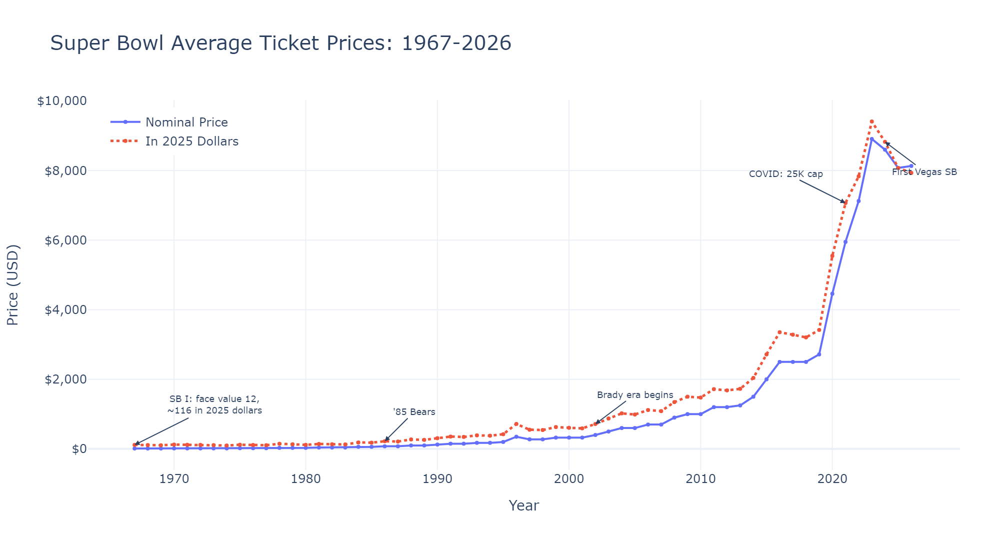
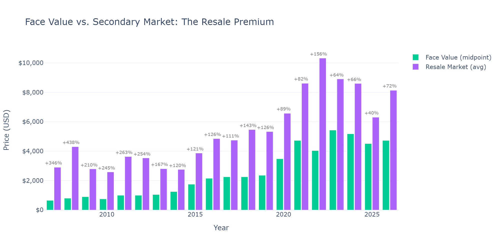
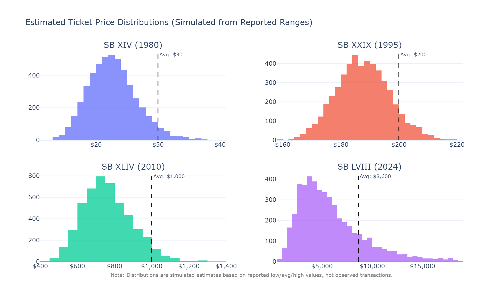
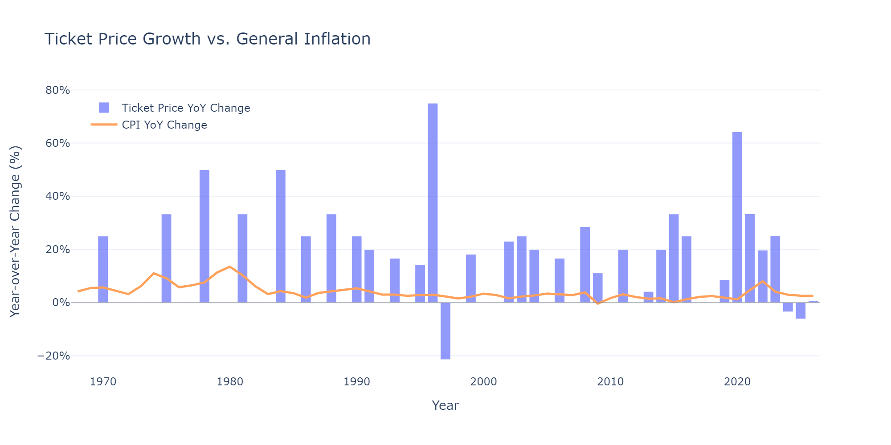
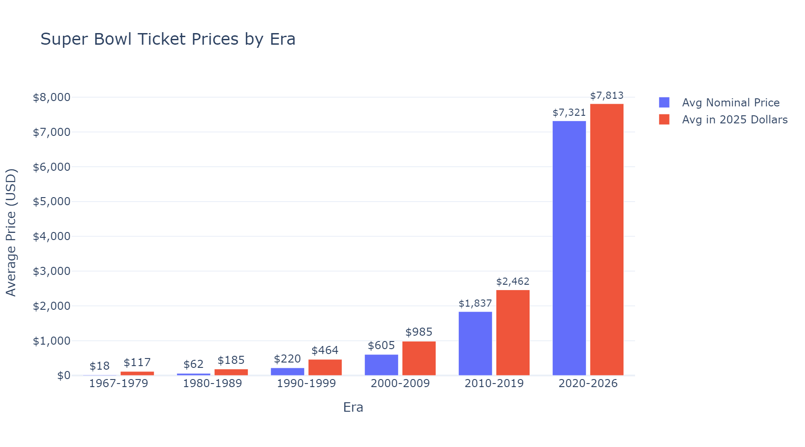
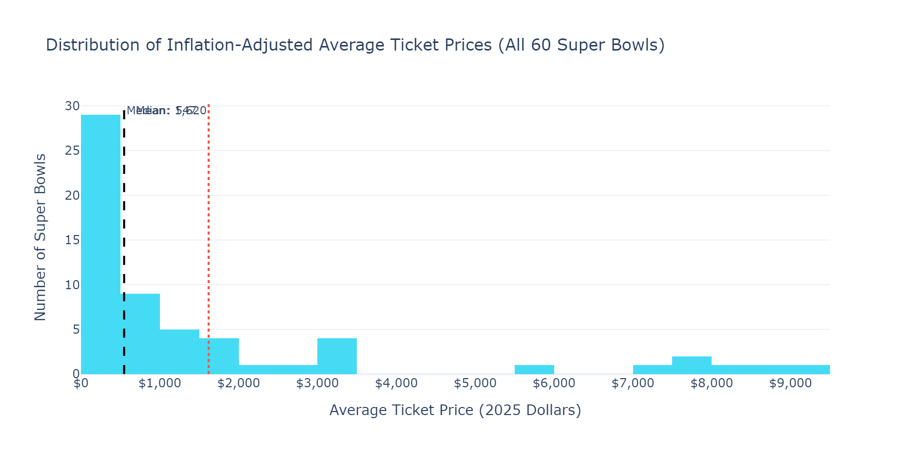

# From $12 to $8,000: The Astonishing Rise of Super Bowl Ticket Prices

*A data-driven look at 60 years of the biggest game in American sports — and what the numbers really mean when you adjust for inflation.*

*This article's content and analytical perspective were crafted by Claude Opus 4.6. The project genesis and direction came from Glenn Highcove. For more information and feedback, connect with Glenn on [LinkedIn](https://www.linkedin.com/in/glennhighcove/).*

---

On January 15, 1967, you could walk up to the Los Angeles Memorial Coliseum and buy a ticket to the first Super Bowl for $12. The game didn't even sell out — over 30,000 seats sat empty.

Fast forward to today: the average Super Bowl ticket now costs more than many Americans earn in a month. But how much of that increase is real, and how much is just the dollar being worth less? I dug into 60 years of data to find out.

---

## The Raw Numbers Tell a Dramatic Story

*Nominal prices (blue) show the sticker shock. Inflation-adjusted prices (red dotted) reveal the true cost increase.*

Three distinct eras emerge from the data:

**The Flat Years (1967–1985):** Prices barely moved. A ticket to Super Bowl I cost $12; by 1985, it was $60. In today's dollars, that entire 18-year span stayed under $250. The Super Bowl was big, but it wasn't yet a luxury product.

**The Steady Climb (1986–2006):** The NFL started treating the game as a premium event. Face values rose from $75 to $700 over two decades. Adjusted for inflation, the real cost roughly tripled during this period.

**The Exponential Era (2007–present):** This is where the chart goes vertical. The emergence of secondary ticket markets (StubHub, SeatGeek, TickPick) made the true market price visible for the first time — and it was far higher than face value. By 2024, the average ticket to Las Vegas's first Super Bowl cost over $8,600.

That $12 ticket from 1967? In today's dollars, it's worth about $116. You still couldn't get into any Super Bowl since 1990 for that price.

---

## The Resale Revolution

*The gap between what the NFL charges and what fans actually pay has grown dramatically. Percentages show the resale markup over face value.*

Here's something most fans don't realize: the NFL only sells about 75% of Super Bowl tickets, and those go to teams, sponsors, and league partners at face value. The rest hit the secondary market, where prices are set by supply and demand.

In 2007, the first year with reliable resale data, the markup over face value was about 346%. By 2022 — the hometown Rams playing at SoFi Stadium — it reached 156% over an already-elevated face value. The total resale average exceeded $10,000.

The NFL captures the face value. The market captures everything above it. Whether that premium goes to brokers, season ticket holders flipping their allotment, or corporate resellers depends on who's selling — but the buyer always pays market price.

---

## What Does "Average" Really Mean?

*Simulated price distributions for four Super Bowls spanning 44 years. Note: these are estimates based on reported price ranges, not observed transactions.*

A single "average price" hides enormous variation. In 1980, there was essentially one price tier — $30 got you in, period. The distribution was tight because there was nothing to distribute.

By 2024, the cheapest seat at Allegiant Stadium cost $950 (face value), while premium 50-yard-line seats exceeded $9,400. The simulated distribution above shows what this spread looks like: a wide, right-skewed curve where most tickets cluster in the middle range, but a long tail of premium seats pushes the average upward.

This matters for how you interpret "average ticket price" statistics. The median fan at a modern Super Bowl pays significantly less than the average suggests, because a small number of ultra-premium tickets skew the mean.

---

## Outpacing Everything

*Blue bars show year-over-year ticket price changes; the orange line shows CPI inflation. Ticket prices routinely jump 20-50% in a single year while general inflation runs at 2-4%.*

The most striking chart in this analysis compares ticket price growth to general inflation. The orange CPI line hugs the bottom of the chart while ticket price bars tower above it.

The biggest single-year jump? 1996 (Super Bowl XXX), when prices rose nearly 75% as the NFL introduced multi-tier pricing. The 2020s brought another surge — COVID-era scarcity at Super Bowl LV (2021) and the novelty of destination cities like Las Vegas and Los Angeles created unprecedented demand.

In only a handful of years did ticket prices *decrease* — and even those drops were modest compared to the gains that preceded them.

---

## A Decade-by-Decade View

*Blue bars show nominal prices; red bars show the same prices converted to 2025 dollars. The gap narrows for recent eras because recent dollars need less inflation adjustment.*

When you group the data by era, the story crystallizes. The 1967-1979 era averaged $18 per ticket nominally — about $117 in today's money. The 2020-2026 era averages over $7,300, which is still about $7,800 after inflation adjustment.

That's not a typo. Even in constant dollars, tickets today cost roughly **67 times** what they did in the first era.

The jump from each era to the next has been accelerating. The 1980s were 3x the 1970s (adjusted). The 2020s are more than 3x the 2010s. This isn't linear growth — it's exponential.

---

## The Full Picture

*Nearly half of all Super Bowls in history had inflation-adjusted average prices under $500. The 2020s are dramatic outliers.*

When you pool all 60 Super Bowls into a single histogram, the skew is unmistakable. Nearly half of all games in history — adjusted to 2025 dollars — had average ticket prices under $500. The median is around $520, while the mean is pulled to roughly $1,600 by the extreme outliers of the 2020s.

The lesson: what we're experiencing right now is not normal. The modern Super Bowl ticket market is a fundamentally different animal from what existed for most of the game's history.

---

## What's Driving This?

Several forces converge to create the modern Super Bowl pricing environment:

- **Scarcity:** Only about 20,000 of ~70,000 tickets reach the public market
- **Corporate demand:** Companies use Super Bowl tickets as business entertainment and client gifts
- **Destination effect:** Las Vegas (2024), Los Angeles (2022), and other destination cities attract buyers who want the trip, not just the game
- **Secondary market transparency:** Platforms like StubHub made the true market-clearing price visible, which paradoxically pushed prices higher as sellers realized what buyers would pay
- **Cultural cachet:** The Super Bowl is increasingly a cultural event, not just a football game. Attendance is a status signal.

---

## Methodology

All prices are sourced from Casino.org, TickPick, Yahoo Sports, and Marco News/USA TODAY Network, cross-referenced for accuracy. Inflation adjustments use the CPI-U (Consumer Price Index for All Urban Consumers) from the Bureau of Labor Statistics, with all values converted to 2025 dollars.

The simulated price distributions use a log-normal model fitted to reported low, average, and high price points. These are estimates of what the distribution *likely* looked like, not observed transaction data.

The complete dataset, code, and interactive versions of all charts are available in the companion Jupyter notebook: [link to GitHub/nbviewer].

---

*All data and visualizations were created using Python, Plotly, and pandas. The full analysis notebook is open-source and reproducible.*
